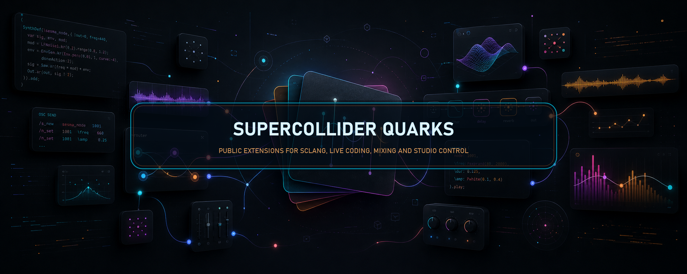

# AutoMixSC



[](https://github.com/ramonsesma/AutoMixSC/releases)
[](https://github.com/ramonsesma/AutoMixSC/actions/workflows/validate.yml)
[](https://github.com/ramonsesma/AutoMixSC/blob/main/LICENSE)
[](https://github.com/ramonsesma/AutoMixSC/releases/tag/0.1.0)

`AutoMixSC` is a portable `sclang`-only DJ mix toolkit that can plan, play, and render the same mix.

## Quick Start

```supercollider
~plan = AutoMixSC.plan([
    (id: \a, bpm: 120, key: "A minor", durationSec: 120),
    (id: \b, bpm: 124, key: "E minor", durationSec: 130)
], (
    count: 2,
    masterBpm: 124,
    transitionBars: 4
));
```

```supercollider
AutoMixSC.play(~plan, nil);
```

```supercollider
AutoMixSC.render(~plan, "mix.wav", \wav);
```

## Install

```supercollider
Quarks.install("https://github.com/ramonsesma/AutoMixSC");
```

## Test

Run from the repository root:

```powershell
& 'C:\Program Files\SuperCollider-3.14.1\sclang.exe' -D -r -s --include-path 'Classes' --include-path 'tests' 'tests\RunAutoMixSC.scd'
```

Or inside sclang after loading the Quark classes:

```supercollider
TestAutoMixSC.run;
```

License: MIT.

